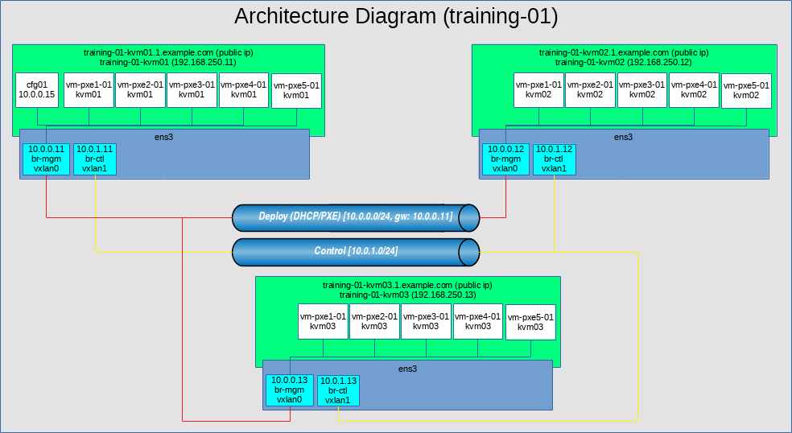
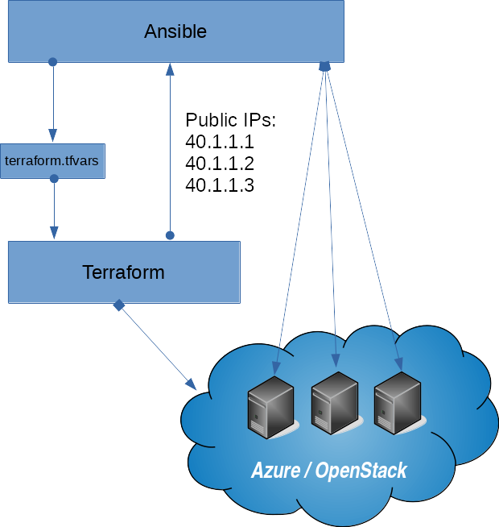

# Training Lab

[](https://travis-ci.org/Mirantis/training-lab)

You will need to have Docker installed.

## Requirements

* [Docker](https://www.docker.com/)

## Network diagram

* Training lab - Architecture diagram



* Ansible + Terraform + Cloud Architecture



### Network schema

| Service | IP / FQDN                      |
|---------|--------------------------------|
| DNS     | 8.8.8.8, 1.1.1.1               |
| NTP     | 0.pool.ntp.org, 1.pool.ntp.org |

| Description                            | Usage                                              | vxlan id | CIDR        | Gateway    |
|----------------------------------------|----------------------------------------------------|----------|-------------|------------|
| Management (MGMT)                      | Management, PXE boot new bare metal servers (Salt) | 10       | 10.0.0.0/24 | 10.0.0.241 |
| Control Plane (Control)                | MCP internal (Salt, Services, API, SDN)            | 11       | 10.0.1.0/24 | 10.0.1.241 |
| Public (Proxy)                         | Users facing (Web UI, API Endpoints)               | 12       | 10.0.2.0/24 | 10.0.2.241 |
| Data                                   | SDN Data plane (optional, recomended)              | 13       | 10.0.3.0/24 | 10.0.3.241 |
| Storage Network (Front-End/Access)     | SDS Front                                          | 14       | 10.0.4.0/24 | 10.0.4.241 |
| Storage Network (Back-End/Replication) | SDS Replication (optional)                         | 15       | 10.0.5.0/24 | 10.0.5.241 |

### Infrastructure overview

| Node type | Hostname        | mgmt network MAC  | FQDN                   | Public FQDN                   | Role/Description   | Cloud IP        | Management IP (br-mgm) | Control IP (br-ctl) | Public/Proxy IP (br-public) | Dataplane IP (br-data) | SDS front IP (br-storage) | SDS Replication IP (br-storrepl) | Type [VM, Nested VM]   | Placement   | RAM | HDD   | CPU |
|-----------|-----------------|-------------------|------------------------|-------------------------------|--------------------|-----------------|------------------------|---------------------|-----------------------------|------------------------|---------------------------|----------------------------------|:----------------------:|:-----------:|-----|:-----:|-----|
| kvm01     | kvm01           | ???               | kvm01.tng.mirantis.com | ???-kvm01.??.tng.mirantis.com | MCP Infra          | 192.168.250.241 | 10.0.0.241             | 10.0.1.241          | 10.0.2.241                  | 10.0.3.241             | 10.0.4.241                | 10.0.5.241                       | VM                     | none        | 64  | 128   | 16  |
| kvm       | kvm02           | ???               | kvm02.tng.mirantis.com | ???-kvm02.??.tng.mirantis.com | MCP Infra          | 192.168.250.242 | 10.0.0.242             | 10.0.1.242          | 10.0.2.242                  | 10.0.3.242             | 10.0.4.242                | 10.0.5.242                       | VM                     | none        | 64  | 128   | 16  |
| kvm       | kvm03           | ???               | kvm03.tng.mirantis.com | ???-kvm03.??.tng.mirantis.com | MCP Infra          | 192.168.250.243 | 10.0.0.243             | 10.0.1.243          | 10.0.2.243                  | 10.0.3.243             | 10.0.4.243                | 10.0.5.243                       | VM                     | none        | 64  | 128   | 16  |
| cfg01     | cfg03           | ???               | cfg01.tng.mirantis.com | none                          | MCP Infra          | none            | 10.0.0.15              | 10.0.1.15           | none                        | none                   | none                      | none                             | Nested VM              | kvm01       | 8   | 50    | 4   |
| cmp01     | cmp01           | ???               | cmp01.tng.mirantis.com | none                          | Compute Node (KVM) | 192.168.250.231 | 10.0.0.231             | 10.0.1.231          | 10.0.2.231                  | 10.0.3.231             | 10.0.4.231                | 10.0.5.231                       | VM                     | none        | 8   | 16    | 2   |
| osd01     | osd01           | ???               | osd01.tng.mirantis.com | none                          | Ceph OSD node      | 192.168.250.221 | 10.0.0.221             | 10.0.1.221          | 10.0.2.221                  | 10.0.3.221             | 10.0.4.221                | 10.0.5.221                       | VM                     | none        | 4   | 20    | 2   |
| pxe       | kvm01-pxe01 | 52:54:00:00:01:01 | kvm01-pxe01        | none                          | PXE MAAS test      | none            | MAAS DHCP              | none                | none                        | none                   | none                      | none                             | Nested VM              | kvm01       | 2   | 5     | 1   |
| pxe       | kvm02-pxe01 | 52:54:00:00:02:01 | kvm02-pxe01        | none                          | PXE MAAS test      | none            | MAAS DHCP              | none                | none                        | none                   | none                      | none                             | Nested VM              | kvm02       | 2   | 5     | 1   |
| pxe       | kvm03-pxe01 | 52:54:00:00:03:01 | kvm03-pxe01        | none                          | PXE MAAS test      | none            | MAAS DHCP              | none                | none                        | none                   | none                      | none                             | Nested VM              | kvm03       | 2   | 5     | 1   |

## Azure related tasks

Few notes how to build the Training environment in Azure using prebuilded Docker image.
Docker image contains [az](https://docs.microsoft.com/en-us/cli/azure/?view=azure-cli-latest), [Terraform](https://www.terraform.io/) + [Ansible](https://www.ansible.com/).

Create Service Principal and authenticate to Azure - this should be done only once for the new Azure accounts:

* [https://www.terraform.io/docs/providers/azurerm/authenticating_via_service_principal.html](https://www.terraform.io/docs/providers/azurerm/authenticating_via_service_principal.html)

* [https://docs.microsoft.com/en-us/azure/virtual-machines/linux/terraform-install-configure](https://docs.microsoft.com/en-us/azure/virtual-machines/linux/terraform-install-configure)

```bash
echo "*** Login to the Azure CLI"
az login

echo "*** Get Subscription ID for Default Subscription"
SUBSCRIPTION_ID=$(az account list | jq -r '.[] | select (.isDefault == true).id')

echo "*** Create the Service Principal which will have permissions to manage resources in the specified Subscription"
az ad sp create-for-rbac --role="Contributor" --scopes="/subscriptions/$SUBSCRIPTION_ID"

echo "*** Login to Azure using Service Principal and check if it is working"
az login --service-principal -u 0xxxxxxx-xxxx-xxxx-xxxx-xxxxxxxxxxxx -p fxxxxxxx-xxxx-xxxx-xxxx-xxxxxxxxxxxx --tenant 0xxxxxxx-xxxx-xxxx-xxxx-xxxxxxxxxxxx
az vm list-sizes --location westus
```

### Create DNS zone

See the details: [https://docs.microsoft.com/en-us/azure/dns/dns-delegate-domain-azure-dns](https://docs.microsoft.com/en-us/azure/dns/dns-delegate-domain-azure-dns)

```bash
# Create resource group
$ az group create --name training-lab-dns --location "East US 2"
$ az network dns zone create -g training-lab-dns -n tng.mirantis.com

# List DNS nameservers for zone tng.mirantis.com in Azure
# You need to ask the domain owner to delegate the zone "tng.mirantis.com" to the Azure nameservers
$ az network dns zone show -g training-lab-dns -n tng.mirantis.com -o json

# Check if DNS servers are forwarding queries to Azure DNS server
$ dig +short -t SOA tng.mirantis.com
ns1-04.azure-dns.com. azuredns-hostmaster.microsoft.com. 1 3600 300 2419200 300

# Add default "www" CNAME to training.mirantis.com
$ az network dns record-set cname set-record -g training-lab-dns -z tng.mirantis.com -n www -c training.mirantis.com
```

### Create Resource Group holding the images created by packer (optional)

Building own images will speed up the deployment process.
Details can be found here: [https://www.packer.io/docs/builders/azure-setup.html](https://www.packer.io/docs/builders/azure-setup.html) and [https://github.com/hashicorp/packer/blob/master/contrib/azure-setup.sh](https://github.com/hashicorp/packer/blob/master/contrib/azure-setup.sh)

```bash
# Create resource group
az group create --name training-lab-images --location "East US 2"

echo "*** Create application"
az ad app create --display-name "packerbuild" --identifier-uris http://packerbuild --homepage http://packerbuild --password my_packer_password

# Change password: az ad app update --id $(az ad app list | jq -r '.[] | select (.displayName == "packerbuild").appId') --password fxxxxxxxxxxxxxxf

echo "*** Get application id"
CLIENT_ID=$(az ad app list | jq -r '.[] | select (.displayName == "packerbuild").appId')

echo "*** Create service principal"
az ad sp create --id $CLIENT_ID

echo "*** Get service principal id"
OBJECT_ID=$(az ad sp list | jq -r '.[] | select (.displayName == "packerbuild").objectId')

echo "*** Get Subscription ID for Default Subscription"
SUBSCRIPTION_ID=$(az account list | jq -r '.[] | select (.isDefault == true).id')

echo "*** Create permissions"
az role assignment create --assignee $OBJECT_ID --role "Owner" --scope /subscriptions/$SUBSCRIPTION_ID
```

## Build your own images

The standard deployment process download many packages / huge images / repositories form Internet which takes a lot of time.
Build your own images for OpenStack / Azure / local testing to speed up the deployment.

### Build azure images

```bash
export AZURE_CLIENT_ID="$(az ad app list | jq -r '.[] | select (.displayName == "packerbuild").appId')"
export AZURE_CLIENT_SECRET="my_packer_password"
export AZURE_RESOURCE_GROUP_NAME="training-lab-images"
export AZURE_SUBSCRIPTION_ID="$(az account list | jq -r '.[] | select (.isDefault == true).id')"

NAME=training-lab_kvm-ubuntu-16.04-server-amd64   packer build -only=azure-arm training-lab_ubuntu_image.json
NAME=training-lab_kvm01-ubuntu-16.04-server-amd64 packer build -only=azure-arm training-lab_ubuntu_image.json
```

Please check the [packer](packer) directory for more details.

## Build environment on Ubuntu

Follow these commands to install necessary requirements on latest Ubuntu:

```bash
# You can use docker image:
# docker run -e "USER=$USER" --privileged --rm -it ubuntu:latest

sudo apt update -qq
sudo apt install -y curl docker.io git openssh-client sudo

# Change the default docker networking if needed
cat > /etc/docker/daemon.json << EOF
{
  "bip": "192.168.150.1/24",
  "fixed-cidr": "192.168.150.0/24"
}
EOF

sudo service docker start

test -f $HOME/.ssh/id_rsa || ( install -m 0700 -d $HOME/.ssh && ssh-keygen -b 2048 -t rsa -f $HOME/.ssh/id_rsa -q -N "" )

git clone https://github.com/Mirantis/training-lab.git

read -s -p "Ansible Vault Password for Training Lab: " MY_ANSIBLE_VAULT_TRAINIG_LAB_PASSWORD
echo "$MY_ANSIBLE_VAULT_TRAINIG_LAB_PASSWORD" > training-lab/ansible/vault_training-lab.txt

cd training-lab/ansible

# Create OpenStack training environment
./create_openstack.sh
# Delete whole OpenStack structure
./delete_openstack.sh

or

# Create Azure training environment
./create_azure.sh
# Delete whole Azure structure
./delete_azure.sh
```

[](https://asciinema.org/a/195640)

## Deployment steps on kvm01

[https://docs.mirantis.com/mcp/master/mcp-deployment-guide/single/index.html](https://docs.mirantis.com/mcp/master/mcp-deployment-guide/single/index.html) (Start from: To create control plane VMs:)

```bash
# Check the cfg01 console
$ virsh console cfg01.tng.mirantis.com
# or you can ssh to cfg01 once it's installed
$ ssh root@cfg01

# check if installation process finished successfully (it should ends with "reboot")
$ tail -1 /var/log/cloud-init-output.log
+ reboot

# Verify that all your Salt Minion nodes are registered on the Salt Master node
$ salt-key
Accepted Keys:
cfg01.tng.mirantis.com
cmp01.tng.mirantis.com
kvm01.tng.mirantis.com
kvm02.tng.mirantis.com
kvm03.tng.mirantis.com
Denied Keys:
Unaccepted Keys:
Rejected Keys:

# Check salt versions
$ salt '*' test.version
cfg01.tng.mirantis.com:
    2017.7.5
cmp01.tng.mirantis.com:
    2017.7.5
kvm01.tng.mirantis.com:
    2017.7.5
kvm02.tng.mirantis.com:
    2017.7.5
kvm03.tng.mirantis.com:
    2017.7.5

# Verify that the Salt Minion nodes are synchronized by running the following command on the Salt Master node
$ salt '*' saltutil.sync_all

# Check out your inventory to be able to resolve any inconsistencies in your model:
$ reclass-salt --top

# Verify that the following states are successfully applied during the execution of cloud-init:
$ salt-call state.sls linux.system,linux,openssh,salt
$ salt-call state.sls maas.cluster,maas.region,reclass

# Provision MAAS with servers
$ salt-call state.sls maas.machines

#https://github.com/Mirantis/pipeline-library/blob/master/src/com/mirantis/mk/Orchestrate.groovy#L115
$ salt -C 'I@salt:control' state.apply salt.minion
$ salt -C 'I@salt:control' state.apply linux.system
$ salt -C 'I@salt:control' state.apply linux.network
$ salt -C 'I@salt:control' state.apply ntp,rsyslog,libvirt
$ salt -C 'I@salt:control' state.apply salt.control

#https://github.com/Mirantis/pipeline-library/blob/master/src/com/mirantis/mk/Orchestrate.groovy#L174
$ salt -C 'I@salt:control' state.apply glusterfs.server.service
$ salt -C 'I@salt:control' state.apply glusterfs.server.setup
$ salt -C 'I@salt:control' cmd.run gluster peer status; gluster volume status
$ salt -C 'I@salt:control' state.apply glusterfs.client

# Check if cfg01 is configured properly:
$ salt-call state.apply

# Perform the initial Salt configuration
$ salt -C 'I@salt:control' state.apply salt.minion

# Set up the network interfaces and the SSH access
$ salt -C 'I@salt:control' cmd.run 'salt-call state.sls linux.system.user,openssh,linux.network;reboot'

$ salt 'kvm*' state.apply libvirt
```
